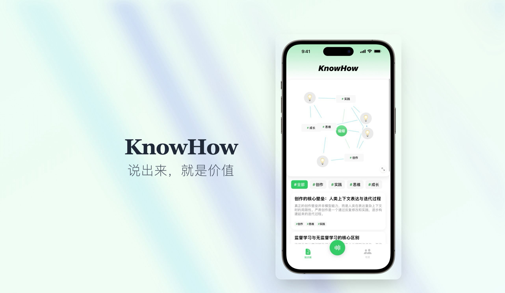

# KnowHow - 知识分享平台

KnowHow 是一个创新的知识分享平台，致力于连接经验分享者与渴望学习的用户群体。我们的核心理念是"说出来，就是价值" - 让每个人的专业知识和经验都能创造价值。

## 🌐 项目链接

- **项目介绍网站**: https://soulwinter.app/
- **项目介绍视频**: http://xhslink.com/m/8lVbgrRqKzd

## 🏗️ 项目架构

本项目采用多平台架构设计：

### Backend - Flask API 后端
- **技术栈**: Python Flask + SQLAlchemy + MySQL
- **AI集成**: LangGraph 工作流处理语音内容
- **认证**: JWT + Flask-Login 双重认证系统
- **API**: RESTful API，支持版本化管理

### iOS App - 移动端应用
- **技术栈**: SwiftUI + Combine
- **核心功能**: 语音录制、实时语音识别、知识图谱可视化
- **图形库**: Grape 库实现交互式知识图谱
- **多语言**: 支持中文、英文语音识别

## 🚀 快速开始

### 后端开发

```bash
# 环境设置
cd backend
./setup_environment.sh

# 启动开发服务器
./start_development.sh  # 运行在 https://127.0.0.1:8888

# 生产环境部署
./start_production.sh
```

### iOS 开发

```bash
# 使用 Xcode 打开项目
open ios/knowhow.xcodeproj

# 或者使用命令行
cd ios
xcodebuild -scheme knowhow -destination 'platform=iOS Simulator,name=iPhone 15' build
```

## 🔧 主要功能

### 语音知识捕获
- 📱 实时语音录制与可视化
- 🎯 多语言语音识别（中文/英文）
- 🤖 AI 驱动的内容处理和标签生成
- 📊 知识图谱自动构建

### 知识管理
- 🏷️ 智能标签系统
- 🔍 内容搜索与过滤
- 📈 知识关联可视化
- 👥 社区知识分享

### 跨平台集成
- 🔄 iOS 到后端的无缝数据同步
- ⚡ 实时任务状态更新
- 🌐 RESTful API 标准接口

## 🛠️ 技术栈详情

### 后端技术
- **Framework**: Flask 3.0.0 + Flask-RESTX
- **Database**: MySQL + SQLAlchemy ORM
- **AI/ML**: LangGraph + OpenAI API
- **Authentication**: JWT Extended + Flask-Login
- **Deployment**: Gunicorn + 脚本化部署

### iOS 技术
- **UI Framework**: SwiftUI
- **Audio**: AVFoundation + Speech Framework
- **Visualization**: Grape 1.1.0 (图谱可视化)
- **Architecture**: MVVM + ObservableObject
- **Testing**: Swift Testing Framework

### 数据库模型
```
User (用户)
├── Article (文章) - 一对多
├── UserAudioRecord (语音记录) - 一对多
└── GenerationTask (生成任务) - 一对多

Article (文章)
├── Tag (标签) - 多对多
└── ArticleRelationship (文章关联) - 自关联

GenerationTask (生成任务)
├── UserAudioRecord (语音记录) - 多对多
└── Article (文章) - 一对一
```

## 📱 应用截图




## 🔄 开发工作流

1. **语音输入**: 用户在 iOS 应用中录制语音
2. **实时转录**: SpeechRecognitionManager 实时将语音转为文字
3. **内容处理**: 文字通过 API 发送到后端
4. **AI 增强**: LangGraph 工作流生成标题和标签
5. **知识构建**: 结构化内容存储并更新知识图谱
6. **同步显示**: iOS 应用获取处理结果并展示

## 📄 许可证

⚠️ **重要声明**: 本项目采用 **AGPL-3.0 开源许可证**，具有严格的 Copyleft 限制条款：

- ✅ **允许**: 学习、研究、个人使用、修改和分发
- ❌ **限制**: 商业使用需要特别注意以下要求：
  - 任何基于本项目的网络服务都必须开源
  - 修改后的代码必须以相同许可证开源
  - 必须保留原始版权和许可证声明

⚠️ **商用警告**: 如果您计划将此项目用于商业目的，请务必：
1. 仔细阅读 AGPL-3.0 许可证全文
2. 确保您的使用方式符合许可证要求
3. 考虑联系原作者获取商业授权

详细许可证条款请查看项目根目录的 [LICENSE](LICENSE) 文件。

## 📞 联系我们

如有问题或建议，请通过项目 Issues 联系我们。
